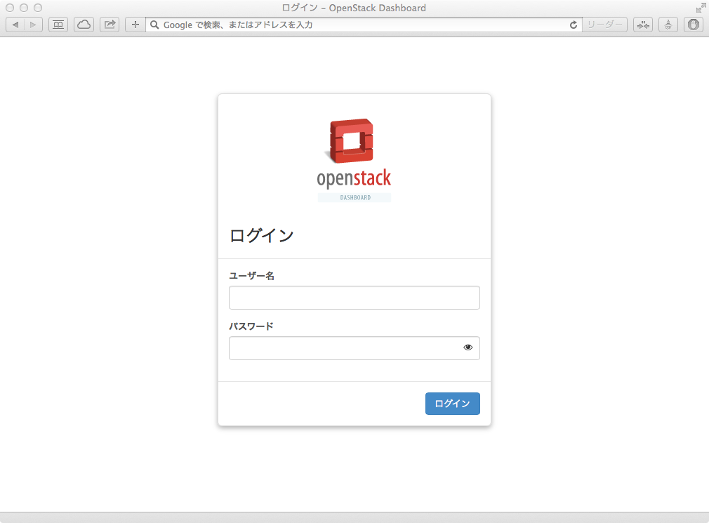

#RDO Kilo-Neutron Quickstart 単体構成編

最終更新日: 2015/05/07

##この文書について
この文書はとりあえず1台に全部入りのOpenStack Kilo環境をさくっと構築する場合の手順を説明しています。

この文書は以下の公開資料を元にしています。

RDO Neutron Quickstart

- <https://www.rdoproject.org/Quickstart>
- <https://www.rdoproject.org/Neutron-Quickstart>
- <https://www.rdoproject.org/Neutron_with_existing_external_network>

##Step 0: 要件

Software:

- Red Hat Enterprise Linux (RHEL) 7以降
- CentOS 7以降
- Fedora 20-22

ワークアラウンドのページも確認してください。

- <https://www.rdoproject.org/Workarounds>

Hardware:

- CPU 3Core以上
- メモリー6GB以上
- 最低1つのNIC(本例は2つのNICを想定)

※All-in-oneの構成を作る場合は、Privateネットワーク用はloインターフェイスを利用できます。

- OpenStack ネットワーク

本書では次のネットワーク構成を利用します。

Instance Network | Private Network | Public Network
---------------- | --------------  | --------------
192.168.2.0/24   | 192.168.0.0/24  | 192.168.1.0/24
gw: 192.168.2.1  | -               | gw: 192.168.1.1
ns: 8.8.8.8      | -               | ns: 192.168.1.1
                  
- OpenStackホスト

eth0            | eth1
--------------  | --------------
192.168.0.10/24 | 192.168.1.10/24

- カーネルパラメータの設定

この設定を書き込み、後述のコマンドで反映させます。

````
# vi /usr/lib/sysctl.d/00-system.conf

net.ipv4.ip_forward = 1
net.ipv4.conf.default.rp_filter = 0
net.ipv4.conf.all.rp_filter = 0
net.ipv4.conf.all.forwarding = 1

# sysctl -e -p /usr/lib/sysctl.d/00-system.conf
（設定を反映）
````

##Step 1: ソフトウェアリポジトリーの追加

ソフトウェアパッケージのインストールとアップデートを行います｡


次のコマンドを実行してリポジトリーを有効化【注1】:

````
# yum install http://rdoproject.org/repos/openstack-kilo/rdo-release-kilo.rpm
````

【注1】正式リリースまでは以下のリポジトリーを追加してください。
http://rdoproject.org/repos/openstack-kilo/rdo-testing-kilo.rpm


システムアップデートの実施:

````
# yum -y update
# reboot
````

##Step 3: Packstackおよび必要パッケージのインストール

以下のようにコマンドを実行します｡

````
# yum install -y openstack-packstack python-netaddr
````


##Step 4:アンサーファイルを生成

以下のようにコマンドを実行してアンサーファイルを作成します｡

````
# packstack --gen-answer-file=answer.txt
(answer.txtという名前のファイルを作成する場合)
````

アンサーファイルを使うことで定義した環境でOpenStackをデプロイできます｡

作成したアンサーファイルは1台のマシンにすべてをインストールする設定が行われています｡IPアドレスや各種パスワードなどを適宜設定します｡

##Step 5:アンサーファイルを自分の環境に合わせて設定

OpenStack環境を作るには最低限以下のパラメータを設定します。項目についてはpackstackのヘルプを確認してください。

- デフォルトパスワードを指定

````
CONFIG_DEFAULT_PASSWORD=password
````

- コンポーネントのインストール可否を指定

インストールする(y)と設定した場合、追加の設定を行う必要があるものもあります。

````
CONFIG_GLANCE_INSTALL=y
CONFIG_CINDER_INSTALL=n
CONFIG_NOVA_INSTALL=y
CONFIG_NEUTRON_INSTALL=y
CONFIG_HORIZON_INSTALL=y
CONFIG_SWIFT_INSTALL=n
CONFIG_CEILOMETER_INSTALL=n
CONFIG_HEAT_INSTALL=n
CONFIG_NAGIOS_INSTALL=y
````

- コンピュートノードを指定(カンマ区切りで複数可)

複数のコンピュートノードを追加するにはカンマでIPアドレスを列挙します｡

- 1つ指定する例

````
CONFIG_COMPUTE_HOSTS=192.168.1.10
````

- 複数指定する例

````
CONFIG_COMPUTE_HOSTS=192.168.1.10,192.168.1.11
````

- NICを利用したいものに変更する

eth1がゲートウェイに接続されている場合の記述例。

（例-1）loを利用(1台構成時のみ可)。

````
CONFIG_NOVA_COMPUTE_PRIVIF=lo
CONFIG_NOVA_NETWORK_PRIVIF=lo
CONFIG_NOVA_NETWORK_PUBIF=eth1
````

（例-2）eth0を利用(複数台構成時やNICを分ける場合)。

````
CONFIG_NOVA_COMPUTE_PRIVIF=eth0
CONFIG_NOVA_NETWORK_PRIVIF=eth0
CONFIG_NOVA_NETWORK_PUBIF=eth1
````

- そのほか、適宜設定を変更する

````
#Message Service
# 'qpid' or 'rabbitmq'
CONFIG_AMQP_BACKEND=rabbitmq
CONFIG_AMQP_HOST=192.168.1.10
CONFIG_AMQP_SSL_PORT=5671
#DB Host
CONFIG_MARIADB_HOST=192.168.1.10
#Region
CONFIG_KEYSTONE_REGION=RegionOne
#MongoDB Host
CONFIG_MONGODB_HOST=192.168.1.10
````

- Dashboardにアクセスするパスワード

````
CONFIG_KEYSTONE_ADMIN_PW=admin
````

- テスト用demoユーザーとかネットワークを作らないようにする

```
CONFIG_PROVISION_DEMO=n
```
- 単体構成にする場合はローカルモードで実行する設定を行う。複数ノードの場合はgre,vxlan,vlanなど

````
CONFIG_NEUTRON_ML2_TYPE_DRIVERS=local
CONFIG_NEUTRON_ML2_TENANT_NETWORK_TYPES=local
````

##Step 6: Packstackを実行してOpenStackのインストール

実行前に、setenforce 0を実行してください。Kilo用のopenstack-selinuxパッケージがまだリリースされていないための対応です。

これはSELinuxのモードを一時的に許容モードに設定するものです。再起動後は元のモードに戻ります([→詳細](https://www.redhat.com/archives/rdo-list/2015-April/msg00200.html))。

````
# setenforce 0
````

設定を書き換えたアンサーファイルを使ってOpenStackを導入するには、次のようにアンサーファイルを指定して実行します。

````
# packstack --answer-file=/root/answer.txt
...
 **** Installation completed successfully ******
````

インストール後に表示されるDashboardのURLにブラウザでアクセスしてみます。ユーザー、パスワードはanswer.txtに設定したものでログインできます。

/rootディレクトリー上にkeystonerc_hogeというユーザー別のRCファイルが作られており、そのファイルでも確認できます。




##Step 7: ネットワーク設定の変更

次に外部と通信できるようにするための設定を行います。外部ネットワークとの接続を提供するノード(1台構成時はそのマシン)に仮想ネットワークブリッジインターフェイスであるbr-exを設定します。

- <https://www.rdoproject.org/Neutron_with_existing_external_network>

###◆public用として使うNICの設定を確認
コマンドを実行して、アンサーファイルに設定したPublic用NIC(ゲートウェイとつながっている方)を確認します。
以降の手順ではeth1であることを前提として解説します。

````
# less {packstack-answers-*,answer.txt}|grep CONFIG_NOVA_NETWORK_PUBIF
CONFIG_NOVA_NETWORK_PUBIF=eth1
````

###◆public用として使うNICの設定ファイルを修正
packstackコマンド実行後、eth1をbr-exにつなぐように設定をします(※BOOTPROTOは設定しない)

eth1からIPアドレス、サブネットマスク、ゲートウェイの設定を削除して次の項目だけを記述し、br-exの方に設定を書き込みます｡

````
# vi /etc/sysconfig/network-scripts/ifcfg-eth1
DEVICE=eth1
ONBOOT=yes
HWADDR=xx:xx:xx:xx:xx:xx # Your eth1's hwaddr
TYPE=OVSPort
DEVICETYPE=ovs
OVS_BRIDGE=br-ex
NM_CONTROLLED=no
````

###◆ブリッジインターフェイスの作成
br-exにeth1のIPアドレスを設定します。

````
# vi /etc/sysconfig/network-scripts/ifcfg-br-ex
DEVICE=br-ex
ONBOOT=yes
DEVICETYPE=ovs
TYPE=OVSBridge
OVSBOOTPROTO=none
OVSDHCPINTERFACES=eth1
IPADDR=192.168.1.10
NETMASK=255.255.255.0  # netmask
GATEWAY=192.168.1.1    # gateway
DNS1=8.8.8.8           # nameserver
DNS2=8.8.4.4
NM_CONTROLLED=no
````

###◆プライベートインターフェイスの設定
プライベートインターフェイスとしてanswer.txtに指定したNICの設定を変更します。loデバイスを指定した場合は特に設定変更する必要はありません。
ただし、loデバイスを指定した場合はall-in-one構成のみしか構成できません。

- answer.txtファイルの設定を確認します。

````
# less {packstack-answers-*,answer.txt}|grep CONFIG_NOVA_NETWORK_PRIVIF
CONFIG_NOVA_NETWORK_PRIVIF=eth0
# less {packstack-answers-*,answer.txt}|grep CONFIG_NOVA_COMPUTE_PRIVIF
CONFIG_NOVA_COMPUTE_PRIVIF=eth0
````

- IP設定を行います。IPアドレスとサブネットマスクの設定を行います。

````
# vi /etc/sysconfig/network-scripts/ifcfg-eth0
DEVICE=eth0
HWADDR=xx:xx:xx:xx:xx:xx # Your eth0's hwaddr
TYPE=Ethernet
ONBOOT=yes
BOOTPROTO=none
IPADDR=192.168.0.10
NETMASK=255.255.255.0
NM_CONTROLLED=no
````

- Packstackインストーラー実行後に、「Warning: NetworkManager is active on 172.17.14.11. OpenStack networking currently does not work on systems that have the Network Manager service enabled.」のようなメッセージが出た場合は、NetworkManagerからnetworkサービスへの切り替え設定を実行します｡再起動後networkサービスが使われます。

````
# systemctl disable NetworkManager
# systemctl enable network
````

ここまでできたらいったんホストを再起動します。

````
# reboot
````

###◆動作確認
Packstackインストーラーによるインストール時にエラー出力がされなければ問題はありませんが、念のためbr-exとNova、Neutronエージェントが導入されてかつ正しく認識されていることを確認しましょう。

まずは再起動後にbr-exが正しく動作し、外のネットワークとつながっていることを確認します。

````
# ip a s br-ex | grep inet
    inet 192.168.1.10/24 brd 192.168.1.255 scope global br-ex
    inet6 fe80::54d3:7dff:fee0:a046/64 scope link
# ping enterprisecloud.jp -c 3 -I br-ex | grep "packet loss"
3 packets transmitted, 3 received, 0% packet loss, time 2003ms
````

パケットロスがないことを確認します。

つぎに、OpenStack NovaコンポーネントのステートがOKであることを確認します。

````
# source /root/keystonerc_admin
(adminユーザー認証情報を読み込む)
# nova-manage service list
Binary           Host      Zone             Status     State Updated_At
nova-consoleauth node1     internal         enabled    :-)   2015-04-28 02:22:19
nova-scheduler   node1     internal         enabled    :-)   2015-04-28 02:22:19
nova-conductor   node1     internal         enabled    :-)   2015-04-28 02:22:19
nova-compute     node1     nova             enabled    :-)   2015-04-28 02:22:19
nova-cert        node1     internal         enabled    :-)   2015-04-28 02:22:19
````

最後に、NeutronのエージェントがOKであることを確認します。

````
# neutron agent-list -c agent_type -c host -c alive
+--------------------+---------+-------+
| agent_type         | host    | alive |
+--------------------+---------+-------+
| Metadata agent     | node1   | :-)   |
| L3 agent           | node1   | :-)   |
| Open vSwitch agent | node1   | :-)   |
| DHCP agent         | node1   | :-)   |
+--------------------+---------+-------+
````

##この後の設定について

次にNeutron Networkを作成します。

[Neutron ネットワークの設定](2-RDO-QuickStart-Networking.md) をご覧ください。